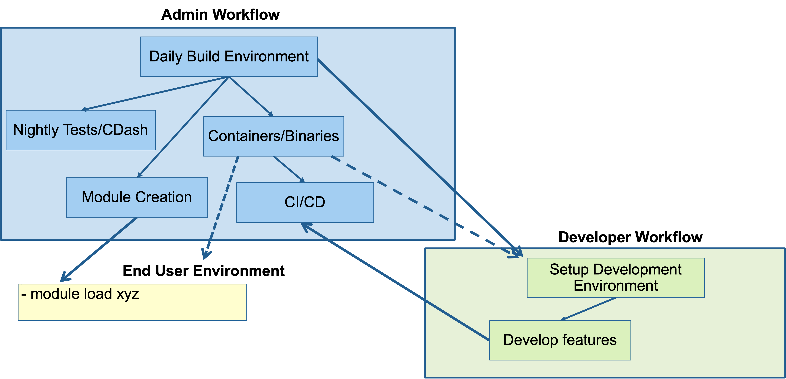
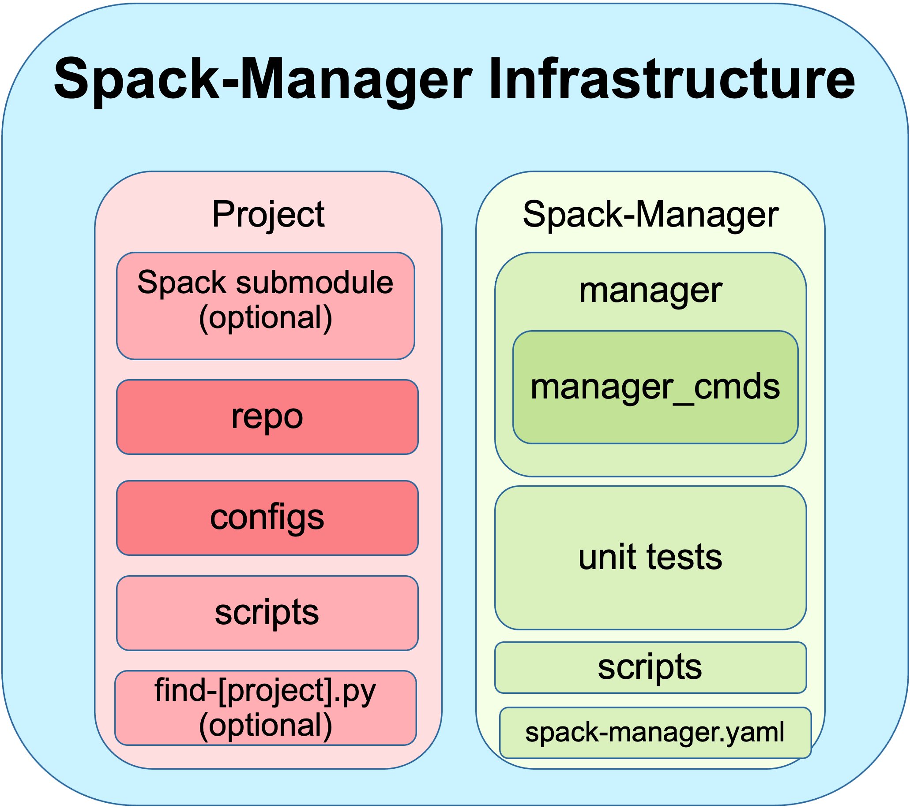
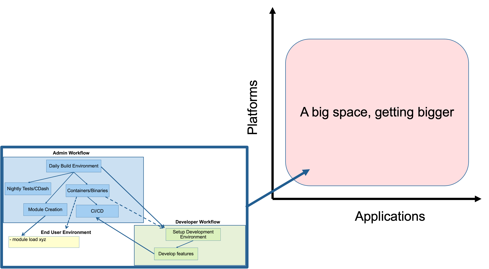

# Spack-Manager Structure

Spack-Manager is a Spack extension that provides a way for software applications
to configure their usage of spack. 

<div>
  
  <p><em>An example of generalized infrastructure requirements that are common across HPC and scientific computing applications. Spack-Manager's goal is to empower these types of infrastructures while still allowing application teams to drive the details.</em></p>
</div>

The code of Spack-Manager is independent of each individual application and each
application code needs to configure a Spack-Manager `Project` to tell Spack-Manager how to work
with their application.

<div>
  
  <p><em>Spack-Manager is designed to provide an abstraction that can support multiple application teams. Each team develops a Project that can be registered with an instance of Spack-Manager.</em></p>
</div>

A `Project` at its core is simply a collection of [spack configuration files](https://spack.readthedocs.io/en/latest/configuration.html),
and [spack package repositories](https://spack.readthedocs.io/en/latest/repositories.html).
A few other optional hooks will be discussed below.

The configuration files in a `Project` are organized based on the configuration bifurcations that the projects supports.
These are called `Machines` based on the guiding principle that spack configurations typically have to be
changed when the machine/system is changed.

`Projects` can be registered with Spack-Manager by adding them to the `spack-manager.yaml` configuration file.
This file lives in the Spack-Manager directory and controls settings for `Spack-Manager` and the `Projects` that
are registered.

``` yaml
spack-manager:
  projects:
    - /path/to/project_a
      default_view: False
    - $HOME/project_b
```

Information on configuring a new `Project` can be found in the system administrator profile documentation [here](https://sandialabs.github.io/spack-manager/user_profiles/system_admins/creating_a_project.html).

<div>
  
  <p><em>The end goal of many code application and DevOps teams is to efficiently span the space of platform permutations and project variations.</em></p>
</div>
