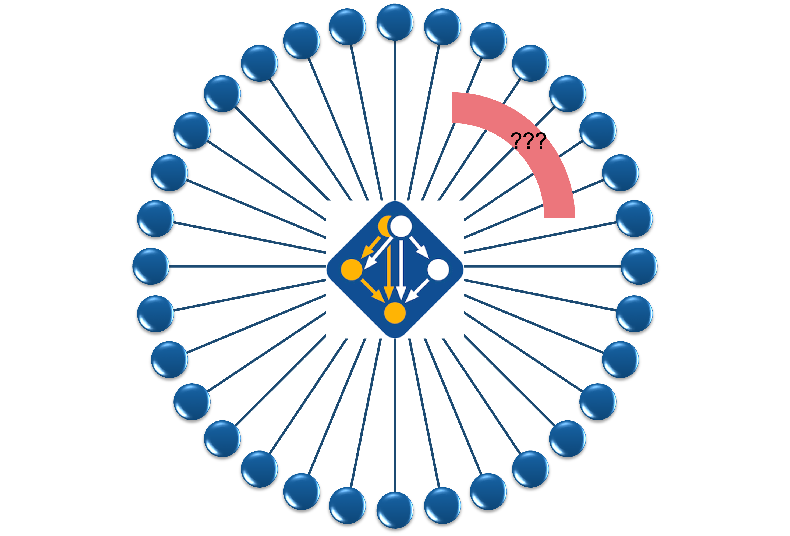
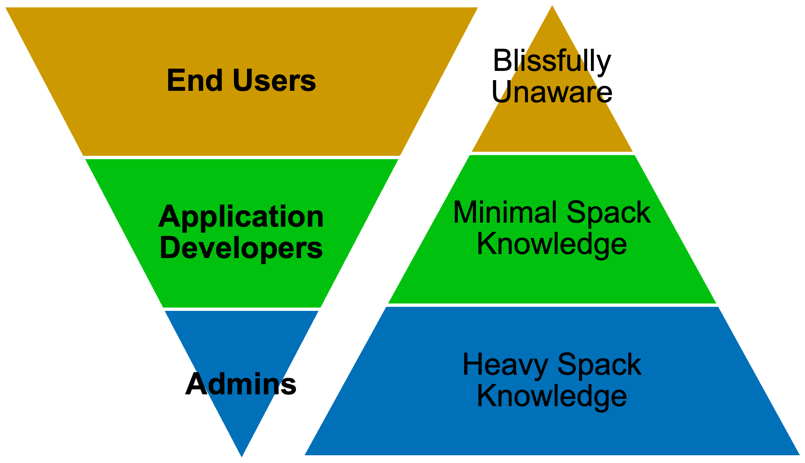

===============
 Spack-Manager
===============

`Spack-Manager <https://github.com/sandialabs/spack-manager>`_ is a light-weight extension to 
`Spack <https://github.com/spack/spack>`_ that is intended to streamline the software development and deployment cycle
for software projects on specific machines.
A given software project typically has multiple configurations across many machines.
Spack-Manager is quite literal in its name, in that it provides a way to manage and organize these configurations
across multiple machines, and multiple projets.

   Spack is serving the package management needs of thousands of software packages.
   However, individual application teams wish to harness the power of Spack for their individual applications specific needs.
   This naturally leads to redundant, similar workflows.

The intent of this project is to maintain as thin of a buffer as possible between software packages and Spack, and to be pushing ideas and workflow
improvements back to Spack on a regular basis to reduce the code that is maintained here.
As such we do not try to fully mask Spack's workflow or commands from users, but rather expose them at a level appropriate for the user type.

User Profiles
=============

Spack-Manager's design is intended to serve three separate user types in a software project, and the level of expected spack exposure/knowledge required
decreases as the user becomes further removed from the build process.  The three user profiles are:

- System administrators (Spack is heavily exposed and relied on)
- Code developers (some basics about Spack are required, but much of the workflow can be scripted away)
- Analysts (zero exposure to Spack)

   Population size of each profile is inverserly proportional to the Spack knowledge required for their roles

Separate documentation exists for each of these user profiles.

.. toctree::
   :maxdepth: 4

   user_profiles/user_profiles

Benefits of Spack-Manager
=========================

- Spack-Manager allows additional agility and coordination at the project level that can not be maintained for a larger tool/database such as Spack. 
   This is done through heavy use of custom Spack `package repositories <https://spack.readthedocs.io/en/latest/repositories.html>`_ and 
   Spack's `custom extensions <https://spack.readthedocs.io/en/latest/extensions.html>`_ to allow for prototyping at the project level, as well as the option to 
   maintain features that are only intended for the project's development team.

- Spack-Manager maximizes overlap between the workflows of the three user profiles. 
   The main thought behind Spack-Manager is that the exact same infrastructure that the system administrators use to deploy binaries and modules on various machines
   can be recycled to run nightly tests, generate time stamped snapshots of binaries for developers to link against, and supply end users
   with production executables.
   This framework is stitched together through Spack, but the end products (binaries and modules) are designed to be as independent from Spack as possible.

- Spack-Manager provides the benefits of Spack by seeking to maintain as small of a wrapper layer as possible. Some of these benefits include:
   - Build reproducibiilty, and scalability
   - Buy-in and feedback from HPC vendors and software developers over thousands of projects
   - Support options, extended documentation and testing through the much larger Spack project

Additional details about the philosophy, and general knowledge can be found in the following documentation section.

.. toctree::
   :maxdepth: 3

   general/general
